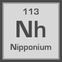

# Nipponium
Toolkit for Japanese text in Rust.

# Features
* Conversion between hiragana, katakana, and romaji.
* Checks for character sets in a string.

# Examples
```
use nipponium::kana::kana;
use nipponium::romaji::romaji;

kana::to_hiragana("アイウエオ");
kana::to_katakana("あいうえお");
kana::is_hiragana("ねこがかわいい")
romaji::to_romaji("だいがくいんはすっごくたいへんだった")
```

# License
MIT (See LICENSE)
